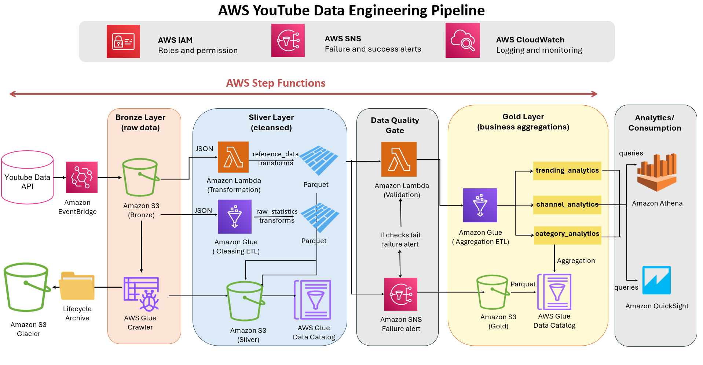
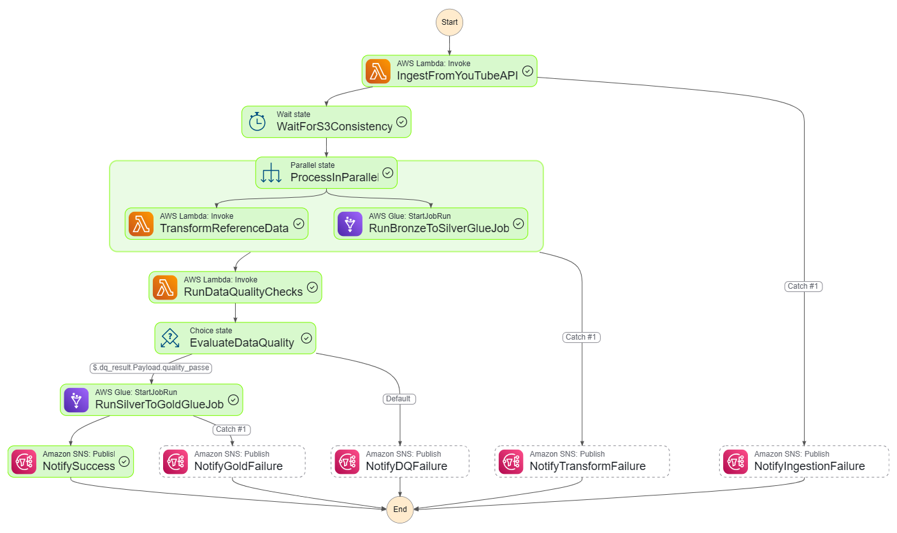

# AWS YouTube Data Engineering Pipeline

## Overview

This project implements an **end-to-end serverless Data Engineering and Analytics pipeline on AWS** that collects, validates, transforms, and analyzes YouTube trending video data.

The pipeline automatically retrieves trending videos and category reference data from the **YouTube Data API v3**, stores raw JSON data in the **Bronze layer** on Amazon S3, transforms it into curated datasets in the **Silver layer**, validates data quality, and produces business-ready analytical datasets in the **Gold layer**.

Gold datasets are cataloged using the **AWS Glue Data Catalog** and queried with **Amazon Athena**. **Power BI** connects to Amazon Athena through the **Amazon Athena ODBC Driver** to provide interactive dashboards for analyzing video trends, channel performance, category popularity, and audience engagement.

The solution is orchestrated using **AWS Step Functions** and designed around a modern **Medallion Architecture (Bronze → Silver → Gold)**, covering the complete data lifecycle from ingestion to business intelligence and visualization.


------------------------------------------------------------------------

# Problem Statement

Millions of videos are published on YouTube every day, making it difficult to identify trending content, compare channel performance, and analyze audience engagement across different countries.

Although the YouTube Data API provides access to this information, the raw API responses are complex, nested, and not optimized for analytical workloads.

The objective of this project is to build an automated AWS Data Engineering pipeline that continuously collects YouTube trending data, transforms it into structured analytical datasets, validates data quality, and makes the data easily accessible for SQL analysis and interactive dashboards.

------------------------------------------------------------------------

# Business Value

The pipeline enables analysts and content creators to:

- identify trending videos across multiple countries;
- compare channel performance;
- analyze audience engagement using views, likes and comments;
- study category popularity over time;
- query analytical datasets with Amazon Athena;
- Explore business KPIs and trends through interactive Power BI dashboards;

------------------------------------------------------------------------

# Architecture



## Architecture Components

### Bronze Layer

-   Amazon EventBridge triggers the pipeline.
-   AWS Step Functions orchestrates the workflow.
-   AWS Lambda retrieves:
    -   Trending videos
    -   Video categories
-   Raw JSON files are stored in Amazon S3.
-   AWS Glue Crawler catalogs Bronze datasets.

### Silver Layer

Two transformations run **in parallel**:

**AWS Glue** - cleans trending statistics - enforces schema - removes
duplicates - calculates derived metrics - writes partitioned Parquet
datasets

**AWS Lambda** - transforms category reference data - validates
categories - stores cleaned reference datasets

Both datasets are registered in the AWS Glue Data Catalog.

### Data Quality Gate

A dedicated Lambda validates:

-   row count
-   schema
-   null percentage
-   freshness
-   numeric ranges

If validation fails, an Amazon SNS notification is sent and the workflow
stops.

### Gold Layer

AWS Glue creates three analytical datasets:

  Dataset              Description
  -------------------- ---------------------------------
  trending_analytics   Daily regional KPIs
  channel_analytics    Channel performance and ranking
  category_analytics   Category trends and engagement

Gold datasets are stored in Amazon S3 and cataloged in AWS Glue.

### Analytics Layer

Amazon Athena performs SQL queries directly on Parquet files.

------------------------------------------------------------------------

# Step Functions Workflow



Pipeline execution:

1.  Ingest data from the YouTube API.
2.  Wait for S3 consistency.
3.  Execute two transformations in parallel:
    -   Bronze → Silver Statistics (Glue)
    -   Reference Data Transformation (Lambda)
4.  Run Data Quality validation.
5.  If validation succeeds:
    -   Execute Silver → Gold Glue job.
6.  Publish SNS success notification.
7.  If any step fails:
    -   Publish the corresponding SNS failure notification.
    
# Power BI Integration

Power BI provides the final **Business Intelligence and visualization layer** of the pipeline.

Instead of connecting directly to raw S3 files, Power BI consumes the analytical datasets exposed through Amazon Athena.

------------------------------------------------------------------------

# AWS Services

-   Amazon S3
-   AWS Lambda
-   AWS Glue
-   AWS Glue Crawler
-   AWS Glue Data Catalog
-   AWS Step Functions
-   Amazon EventBridge
-   Amazon Athena
-   Amazon SNS
-   Amazon CloudWatch
-   AWS IAM

------------------------------------------------------------------------

# Medallion Architecture

## Bronze

Raw JSON data exactly as returned by the YouTube API.

## Silver

Validated, standardized and cleansed datasets stored as Parquet.

## Gold

Business-oriented datasets optimized for reporting and analytics.

------------------------------------------------------------------------

## Prerequisites

Before connecting Power BI to Amazon Athena, make sure that:

- Power BI Desktop is installed
- Gold datasets are available in Amazon S3
- Gold tables are registered in AWS Glue Data Catalog
- Gold tables can be successfully queried from Amazon Athena
- An Athena workgroup is available
- An S3 query result location is configured
- AWS credentials with the required permissions are available

The credentials used by the ODBC connection must have the required permissions to access:

- Amazon Athena
- AWS Glue Data Catalog
- The relevant Amazon S3 resources
---

# Installing the Amazon Athena ODBC Driver

Power BI uses the **Amazon Athena ODBC Driver** to communicate with Amazon Athena.

Download the official driver from AWS:

https://docs.aws.amazon.com/athena/latest/ug/odbc-v2-driver.html

For a 64-bit Power BI Desktop installation on Windows, install the **64-bit Amazon Athena ODBC Driver**.

After installation, open:

```text
Windows
   ↓
ODBC Data Sources (64-bit)
   ↓
System DSN
   ↓
Add
   ↓
Amazon Athena ODBC Driver
```

---
# Configuring the Athena ODBC DSN

Create a new Data Source Name (DSN).

Example:

```text
Data Source Name: YouTube_Athena
Region: us-east-1
Workgroup: primary
Authentication Type: Default Credentials
```

The AWS Region must correspond to the region where the Athena resources used by the project are configured.

##  ODBC Connection

Power BI can also connect through the generic ODBC connector.

Select:

```text
Home
   ↓
Get Data
   ↓
ODBC
```

Then select:

```text
YouTube_Athena
```

Power BI uses the existing Athena DSN and its configured AWS authentication.

After connecting successfully, Power BI can access the analytical tables exposed through Athena.

# Features

-   Fully serverless architecture
-   Event-driven orchestration
-   Parallel processing
-   Automated data quality validation
-   Medallion Architecture
-   Glue Data Catalog integration
-   Athena SQL analytics
-   SNS alerting
-   CloudWatch monitoring


------------------------------------------------------------------------

# Author

Personal AWS Data Engineering project developed to demonstrate practical skills in:

-   Data Engineering
-   AWS Serverless
-   ETL Pipelines
-   Medallion Architecture
-   Apache Spark
-   AWS Glue
-   Workflow Orchestration
